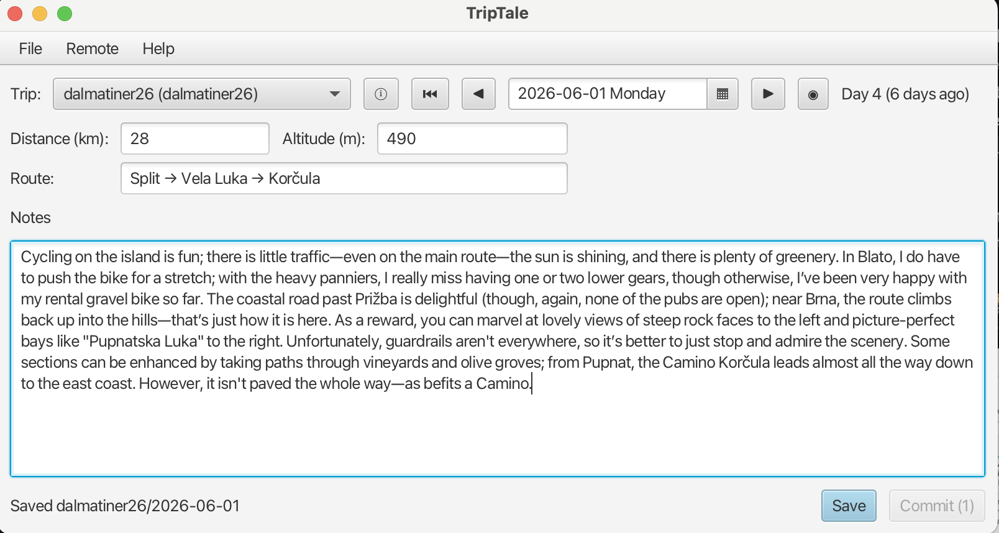

# TripTale 🏔️🚴

> An offline-first diary for long cycling and hiking trips — your notes live as plain Markdown in a git repo you own.

TripTale is a small JavaFX app for keeping a day-by-day journal of a trip: kilometres ridden, altitude climbed, and whatever notes you want to scribble. The twist: there is no cloud, no account, no database. Every entry is a plain Markdown file on disk, and the whole thing is a git repository — so you can sync between machines, hack it from the command line, or never touch the app again and just edit `.md` files in your favourite editor.

> ⚠️ **Status:** personal hobby project / early PoC. Works for me on macOS. No roadmap, no promises — but contributions and ideas are welcome.

## Why? 🤔

I wanted a trip diary that:

- Works **without internet**, on a campsite, on a ferry, halfway up an Alpine pass.
- Stores my notes in a format I'll still be able to read in 20 years (plain text > proprietary blobs).
- Syncs between my laptop and desktop without me logging into yet another service.
- Lets me edit entries from *anywhere* — the app on my laptop, `vim` on the road, Obsidian when I get home.

Git + Markdown turned out to be the answer. TripTale is just a friendly UI on top of that.

## Screenshot 📸

<!-- TODO: drop a real screenshot here -->


```
+----------------------------------------------+
|  TripTale — Alps 2026                        |
|  ┌────────────────────────────────────────┐  |
|  │  2026-06-04  ▼     km: 87   alt: 1840m │  |
|  ├────────────────────────────────────────┤  |
|  │  Crossed the Gotthard pass today.      │  |
|  │  Strong headwind from the south, but   │  |
|  │  the descent into Airolo was worth it. │  |
|  └────────────────────────────────────────┘  |
|  [ Save ]  [ Pull ]  [ Push ]                |
+----------------------------------------------+
```

## How it stores your data 💾

Everything lives under one directory (default `~/.triptale`), which is itself a git repo:

```
~/.triptale/                          # single git repo
├── trip.md                           # Tolaria type definition for a trip
├── tale.md                           # Tolaria type definition for a diary entry
└── trips/
    └── alps-2026/
        ├── trip.yml                  # name, start date, description
        └── entries/
            └── 2026-06-04_Thursday.md
```

A diary entry is just Markdown with a YAML frontmatter block — structured fields on top, free notes below:

```markdown
---
altitude: 1840.0
date: 2026-06-04
distance: 87.0
route: Andermatt → Airolo
trackurl: https://www.strava.com/activities/123456
type: Tale
---

Crossed the Gotthard pass today. Strong headwind from the south,
but the descent into Airolo was worth it.
```

Frontmatter keys are always written in alphabetical order, so saving an entry never produces a noisy diff.

The optional `trackurl` field links the day to an external tracking tool (Strava, Komoot, …). In the app it sits next to distance and altitude; when it holds a valid `http(s)` URL a 🔗 button opens it in your system browser.

Every entry carries `type: Tale`, and the data dir gets `trip.md`/`tale.md` type-definition notes at its root. These make the whole data directory a valid [Tolaria](https://github.com/refactoringhq/tolaria) vault — an alternative Markdown-based editor/knowledge-graph app — so you can browse and edit your trips there too, in addition to TripTale and any plain text editor.

That's it. No database, no schema migrations. If TripTale disappears tomorrow, your trips remain a perfectly readable folder of Markdown.

## The app-free workflow ✍️

Because everything is just files, **you don't actually need the app to use TripTale.** A perfectly valid workflow is:

```bash
cd ~/.triptale/trips/alps-2026/entries
vim 2026-06-04_Thursday.md          # write your day
cd ~/.triptale
git add . && git commit -m "Day 4"
git push                            # if you've set a remote
```

The next time you open the JavaFX app, your entries are right there. Use the app when you want a nicer editing surface; use any editor when you don't. Both round-trip cleanly through git.

This also means you can keep writing offline for weeks — every save is a local git commit — and push the whole batch the moment you find Wi-Fi.

## Export 📤

The **File → Export Diary** menu renders the entire trip as a single Markdown document — headings per day, cumulative distance and altitude totals — which you can copy to clipboard and paste anywhere. Export uses a handful of small Mustache-style templates in `src/main/resources/export/` if you want to tweak the output format.

## Impressions & Faves 📸

Two optional settings (Settings dialog, or `impressionsFilePattern` / `impressionsFaveFilePattern`
in `settings.yml`) let TripTale find that day's photos on disk — shown as an "N Impressions" /
"N Faves" button per entry, and embeddable as an image grid in HTML export.

Each pattern is a filesystem path containing `${VAR}` placeholders:

| Variable         | Expands to                                  | Example              |
|------------------|----------------------------------------------|-----------------------|
| `${HOME}`        | user home directory                          | `/Users/alice`        |
| `${DATE}`        | the entry's date, `yyyyMMdd`                 | `20260807`            |
| `${TRIP_SLUG}`   | the active trip's slug                       | `iceland-roadtrip`    |
| `${TRIP_YEAR}`   | the active trip's start-date year            | `2026`                |
| `${TRIP_MONTH}`  | the active trip's start-date month, 2-digit  | `06`                  |

After substitution, the pattern is split on `/` and matched one directory level at a time —
**every** segment may contain wildcards, not just the filename:

- `*` matches any run of characters, `?` matches exactly one — both only within a single
  segment, never across a `/`.
- A segment with no wildcard must match an existing file/directory exactly.
- A segment with a wildcard is matched against that directory's children; if more than one
  matches, the first one (sorted by name) is used and a warning is logged — it doesn't fail.
- The resolved directory is cached for as long as a trip stays open, so only the final
  filename glob is re-evaluated as you navigate between days.

Expansion happens at the moment images are actually looked up, not when settings are saved —
so pointing at a USB drive or NAS that isn't always mounted just yields "No Impressions"
rather than an error.

Examples, from simplest to most specific:

```
${HOME}/Pictures/00_Faves/output/${DATE}*.jpg
```
One shared folder for every trip; photos are matched purely by date.

```
${HOME}/Pictures/${TRIP_YEAR}/${TRIP_MONTH}_??_${TRIP_SLUG}/output/${DATE}*.jpg
```
A per-trip folder, e.g. `Pictures/2026/06_ab_iceland-roadtrip/output/` — the `??` absorbs two
extra characters you typed by hand between month and slug when naming the folder.

```
${HOME}/Pictures/${TRIP_YEAR}_${TRIP_MONTH}_??_${TRIP_SLUG}/output/${DATE}*.jpg
```
Same idea, but year/month/slug combined into one directory name instead of nested folders,
e.g. `Pictures/2026_06_ab_iceland-roadtrip/output/`.

## Run it 🛠️

Requires **Java 25** and Maven (uses `mvnd` by default).

```bash
make run        # or: mvnd javafx:run
make build      # package without tests
make test       # run unit tests
```

### Windows notes

- The project uses platform-specific JavaFX native libraries. On macOS/Linux the default setup works without changes. On Windows the JVM needs the JavaFX native jars on the module-path; the repository includes a Windows-only Maven profile that copies the native jars and configures `spring-boot:run` accordingly.
- On Windows use the system `mvn` (not `mvnd`). The `Makefile` detects this automatically and will call `mvn -Pwindows-javafx javafx:run` when run on Windows. You can also run directly:

```
mvn -Pwindows-javafx spring-boot:run
```

- If you get module not found errors (e.g. "Module javafx.controls not found"), run with the Windows profile as shown above. If you prefer to run the jar directly after `make build`, use `make run-jar` which starts the prebuilt JAR with recommended JVM flags.

- Java may warn about restricted native access or `sun.misc.Unsafe` usage when JavaFX native libs load; these are known warnings and the app continues to run. To silence the native-access warning you can add `--enable-native-access=javafx.graphics` to your JVM options.

Point at a different data directory (e.g. a USB stick for travel):

```bash
mvn javafx:run -Dtriptale.data-dir=/Volumes/USB/triptale
```

## Configuration ⚙️

Override defaults via `application.yml`, env vars, or `-D` flags:

| Property                     | Default       | Notes                                       |
|------------------------------|---------------|---------------------------------------------|
| `triptale.data-dir`          | `~/.triptale` | Root directory; also the git repo root      |
| `triptale.git.author-name`   | *(blank)*     | Falls back to system git config             |
| `triptale.git.author-email`  | *(blank)*     | Falls back to system git config             |

To enable push/pull, add a remote in the data dir: `git -C <data-dir> remote add origin <url>`.

## Tech stack 🧰

- **Java 25** with records for the domain types
- **Spring Boot** (headless — `web-application-type: none`) for DI, config binding, and lifecycle
- **JavaFX** for the UI, with FXML controllers resolved as Spring beans
- **JGit** for in-process git operations (init, commit, status); `push`/`pull` delegate to the OS `git` binary via `ProcessBuilder`
- **Jackson YAML** for reading and writing `trip.yml` and entry frontmatter
- **Maven** as the build system; a thin `Makefile` wraps the common targets (uses `mvnd` by default)

The interesting bit architecturally is that JavaFX's `Application.init()` boots Spring *before* `start()`, and the FXML loader uses `spring::getBean` as its controller factory — so controllers are real Spring beans with constructor-injected services. See `CLAUDE.md` for more on the layering.

## Contributing 🤝

This is a hobby project, but PRs, issues, and ideas are welcome. A few ground rules:

- Keep JavaFX imports out of the `storage`, `git`, `config`, `export`, and `domain` packages.
- Domain types are records — keep them plain.
- Constructor injection only, no field `@Autowired`.
- New write operations should save first, then call `addPending(...)` in `MainController` — do not commit from inside the storage layer.

If you're thinking of something larger than a small fix, open an issue first so we can talk about it.

## License 📜

Apache License 2.0 — see [LICENSE](LICENSE).
