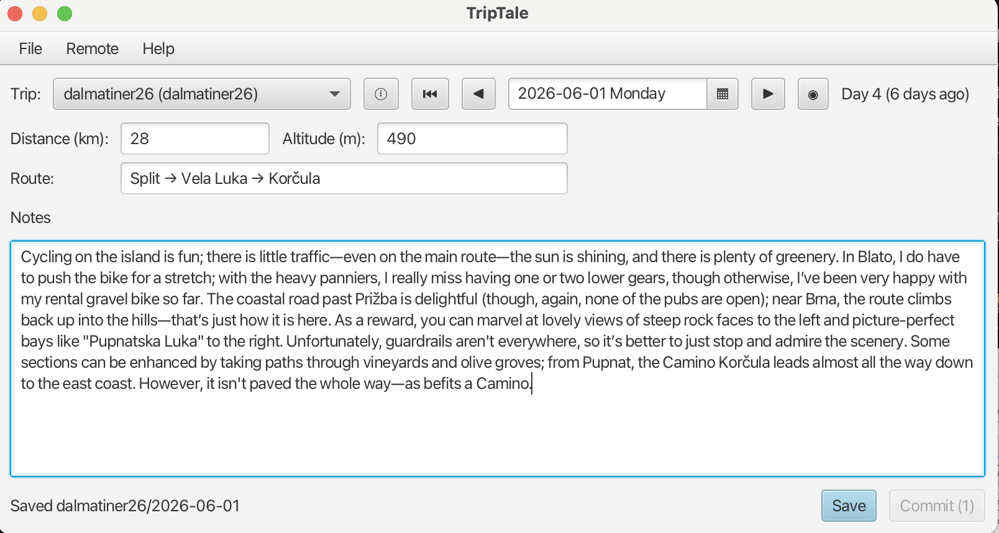

# TripTale 🏔️🚴

> An offline-first diary for long cycling and hiking trips — your notes live as plain Markdown in a git repo you own.

TripTale is a small JavaFX app for keeping a day-by-day journal of a trip: kilometres ridden, altitude climbed, where you started and stopped, and whatever notes you want to scribble. The twist: there is no cloud, no account, no database. Every entry is a plain Markdown file on disk, and the whole thing is a git repository — so you can sync between machines, hack it from the command line, or never touch the app again and just edit `.md` files in your favourite editor.

> ⚠️ **Status:** personal hobby project. Used daily on macOS; a prebuilt jar runs on Linux, Windows builds locally. No roadmap, no promises — but contributions and ideas are welcome.

## Why? 🤔

I wanted a trip diary that:

- Works **without internet**, on a campsite, on a ferry, halfway up an Alpine pass.
- Stores my notes in a format I'll still be able to read in 20 years (plain text > proprietary blobs).
- Syncs between my laptop and desktop without me logging into yet another service.
- Lets me edit entries from *anywhere* — the app on my laptop, `vim` on the road, Obsidian or [Tolaria](https://github.com/refactoringhq/tolaria) when I get home.

Git + Markdown turned out to be the answer. TripTale is just a friendly UI on top of that.

## Screenshot 📸



## Features ✨

- **Trips and tales** — one trip per journey, one tale (Markdown entry) per day, with distance, altitude, track URL and start/stop coordinates. Navigate by year, trip and day (`⌘⌥←` / `⌘⌥→`).
- **GPX import** — create a new trip or prefill a day's title and start point from a GPX file (komoot, Strava, …).
- **Maps** — open a day's start point in Google Maps, or see all start points of a trip on a Mapbox static map (needs a Mapbox token in Settings).
- **Impressions & Faves** — show that day's photos straight from your picture folders, see [below](#impressions--faves-).
- **Export** — render a whole trip as one Markdown document (copy to clipboard) or as an HTML page with a photo gallery.
- **Smart Sync** (`⌘K`) — commit, rebase onto the remote, push, and sync the backpack in one dialog, see [below](#git--smart-sync-).
- **Backpack 🎒** — keep GPX files, PDFs, tickets etc. next to each day, optionally synced to S3, see [below](#backpack-).

## How it stores your data 💾

Everything lives under one **data directory**, which is itself a git repo. You choose its location on first start (⚙ Edit Settings…); until then the app stays inert and reminds you on every launch.

```
triptale-data/                         # git repo
├── .gitignore                         # ignores .state.yml
├── .state.yml                         # app bookkeeping (last opened trip), never committed
├── trip.md  tale.md  type.md          # Tolaria type definitions
├── 2026/                              # year of the trip's start date
│   └── alps-2026/                     # trip slug, fixed at creation
│       ├── README.md                  # the trip: name, dates, description
│       ├── 2026-06-04-Thursday.md     # one tale per day
│       └── 2026-06-05-Friday.md
└── attachments/                       # the backpack (optional), see "Backpack"
    └── 2026/alps-2026/2026-06-04-Thursday/
        └── gotthard.gpx
```

A tale is just Markdown with a YAML frontmatter block — structured fields on top, the day's title as the first heading, free notes below:

```markdown
---
altitude: 1840.0
belongs_to: "[[2026/alps-2026/README]]"
date: 2026-06-04
distance: 87.0
start_lat: 46.6356
start_lon: 8.5939
stop_lat: 46.5287
stop_lon: 8.6097
trackurl: https://www.strava.com/activities/123456
type: Tale
---

# Andermatt → Airolo

Crossed the Gotthard pass today. Strong headwind from the south,
but the descent into Airolo was worth it.
```

The trip's `README.md` works the same way: `start_date`, `end_date` and `type: Trip` in the frontmatter, the trip name as `# Heading`, the description below.

- Frontmatter keys are always written in alphabetical order, so saving never produces a noisy diff.
- Fields you didn't fill in are left out; `0` is a real measurement, a missing key means "not recorded".
- `trackurl` links the day to an external tracking tool; when it holds a valid `http(s)` URL, a 🔗 button opens it in your browser.
- `type: Tale` / `type: Trip`, the `belongs_to` wiki link and the `trip.md`/`tale.md`/`type.md` definitions make the data directory a valid [Tolaria](https://github.com/refactoringhq/tolaria) vault, so you can browse and edit your trips there too.
- A trip's slug (its directory name) is derived from its name once and never changes, even if you rename the trip later.

That's it. No database, no schema migrations. If TripTale disappears tomorrow, your trips remain a perfectly readable folder of Markdown.

## The app-free workflow ✍️

Because everything is just files, **you don't actually need the app to use TripTale.** A perfectly valid workflow is:

```bash
cd ~/triptale-data/2026/alps-2026
vim 2026-06-04-Thursday.md          # write your day
git add . && git commit -m "Day 4"
git push                            # if you've set a remote
```

The next time you open the app, your entries are right there. Use the app when you want a nicer editing surface; use any editor when you don't. Both round-trip cleanly through git — Smart Sync picks up files you changed outside the app, too.

## Git & Smart Sync 🔄

Saving a tale (`⌘S`) writes the file to disk immediately but does **not** commit. Commits happen when you ask for them, so a day of small edits becomes one commit instead of twenty.

**🔄 Smart Sync** (`⌘K`, then `Enter`) is the "make my data safe" button. It saves the open tale first, then shows a dialog with one row per step, each of which you can untick:

- **Commit** — everything git sees as changed, with a generated (editable) message.
- **Git Remote** — fetch, rebase onto the remote, push. The row shows "↓ 3 incoming · ↑ 2 outgoing" before you start. On a rebase conflict nothing is lost: the rebase is aborted, push is skipped, and you resolve it by hand (terminal, Tolaria, …) and sync again.
- **Backpack** — only in `cloud` mode, see below.

You can keep writing offline for weeks and sync the whole batch the moment you find Wi-Fi. The toolbar shows whether the git host is reachable; online-only actions are disabled while it isn't. The low-level steps (Commit, Pull Git, Push Git, Remote Info) are still in the **Repository** menu.

To enable push/pull, add a remote to the data dir: `git -C <data-dir> remote add origin <url>`. Push and pull use your OS `git` binary, so your usual SSH keys or credential helper apply.

## Backpack 🎒

The backpack holds the big stuff that doesn't belong in Markdown: GPX tracks, PDFs, tickets, photos. **🎒 Add to Backpack…** (Tale Entries menu) copies files into a folder for the current day: `attachments/<year>/<slug>/<day>/`. How they are synced is set by **Backpack sync** in Settings:

| Mode | What happens |
|---|---|
| `off` (default) | Files stay on this machine only; `attachments/` is git-ignored so it doesn't weigh down the repo. |
| `git` | Files are committed and synced with your Markdown files. Fine for a few small files. |
| `cloud` | Files stay out of git and are synced with an **S3 bucket** — via Smart Sync or ☁ Push / ☁ Pull Backpack. |

Cloud sync copies both ways and never deletes: pull downloads what's missing locally (never overwriting a local file), push uploads what's new or changed (by size and MD5). Object keys mirror the local layout (`<prefix>/attachments/<year>/<slug>/<day>/<file>`), so the bucket stays browsable.

For `cloud` mode you need a bucket URL (`s3://bucket/optional-prefix/`), region, and an access key ID + secret. Use a dedicated IAM user restricted to that bucket (list, get, put) rather than your own credentials. TripTale talks to S3 directly (no AWS SDK, no extra tools). The keys are stored in `settings.yml`, which lives outside the data repo and is never committed. Background and design notes: [docs/33a_attachments_mvp.md](docs/33a_attachments_mvp.md).

## Impressions & Faves 📷

Each entry has a **📷 Impressions 12 🗂 / 3 🎒** button: that day's images in your local photo
library (🗂) and in the day's backpack (🎒). It opens a photo viewer where you choose the
source — **Trip Backpack**, **Local Photo Lib**, or **Pick Folder** (any folder, e.g. a camera
card) — narrow it to faves, tick images and **🎒 Import Selected** them into that day's backpack.
Imports copy the originals (EXIF included); a same-named file is overwritten. The backpack
travels with the data dir (git or S3), so unlike the photo library it's available on every
machine.

Three settings shape what counts as an impression (Settings dialog or `settings.yml`):

- `impressionsBaseFilter` — space-separated filename globs, default `*.jpg *.jpeg *.png`; applied
  to every source first, so GPX tracks, PDFs etc. never show up.
- `impressionsFaveFilter` — space-separated globs marking faves, e.g. `*+.*` for a `+` at the end
  of the basename; enables the **Faves only** checkbox in the viewer and the export. Both filters
  match the filename only and ignore case.
- `impressionsFilePattern` — where the local photo library lives, see below.

The photo library pattern is a filesystem path containing `${VAR}` placeholders:

| Variable         | Expands to                                  | Example              |
|------------------|----------------------------------------------|-----------------------|
| `${HOME}`        | user home directory                          | `/Users/alice`        |
| `${DATE}`        | the entry's date, `yyyyMMdd`                 | `20260807`            |
| `${TRIP_SLUG}`   | the active trip's slug                       | `iceland-roadtrip`    |
| `${TRIP_YEAR}`   | the active trip's start-date year            | `2026`                |
| `${TRIP_MONTH}`  | the active trip's start-date month, 2-digit  | `06`                  |
| `${TRIP_DAY}`    | the active trip's start-date day, 2-digit    | `04`                  |

After substitution, the pattern is split on `/` and matched one directory level at a time —
**every** segment may contain wildcards, not just the filename:

- `*` matches any run of characters, `?` matches exactly one — both only within a single
  segment, never across a `/`.
- A segment with no wildcard must match an existing file/directory exactly.
- A segment with a wildcard is matched against that directory's children; if more than one
  matches, the first one (sorted by name) is used and a warning is logged — it doesn't fail.
- The resolved directory is cached for as long as a trip stays open, so only the final
  filename glob is re-evaluated as you navigate between days.

Expansion happens at the moment images are actually looked up, not when settings are saved —
so pointing at a USB drive or NAS that isn't always mounted just yields a count of 0
rather than an error.

Examples, from simplest to most specific:

```
${HOME}/Pictures/00_Faves/output/${DATE}*.jpg
```
One shared folder for every trip; photos are matched purely by date.

```
${HOME}/Pictures/${TRIP_YEAR}/${TRIP_MONTH}_??_${TRIP_SLUG}/output/${DATE}*.jpg
```
A per-trip folder, e.g. `Pictures/2026/06_ab_iceland-roadtrip/output/` — the `??` absorbs two
extra characters you typed by hand between month and slug when naming the folder.

```
${HOME}/Pictures/${TRIP_YEAR}_${TRIP_MONTH}_??_${TRIP_SLUG}/output/${DATE}*.jpg
```
Same idea, but year/month/slug combined into one directory name instead of nested folders,
e.g. `Pictures/2026_06_ab_iceland-roadtrip/output/`.

## Export 📤

**⇧ Export Diary…** renders the trip as a single Markdown document — headings per day, cumulative distance and altitude totals — which you can copy to the clipboard, or open as an HTML page in your browser, optionally with each day's impressions (from the photo library or the backpack, all or faves only) as a photo gallery. A **From / To** range narrows it to some days, with totals for just those; **⇧ Export Tale** next to Save exports only the current day. Export uses a handful of small Mustache-style templates in `src/main/resources/export/` if you want to tweak the output.

## Run it 🛠️

Requires **Java 25**. Building also needs Maven (`make` uses `mvnd` if it's installed, plain `mvn` otherwise).

```bash
make run        # build + launch via Maven — best while developing
make run-fast   # launch with a JDK AOT cache — ~1.5 s faster startup, best for daily use
make build      # build target/triptale.jar without running tests
make test       # run unit tests
make app        # macOS only: build TripTale.app (target/dist/)
make help       # list all targets
```

`make run-fast` rebuilds the jar when the sources changed. On its first run (and after every rebuild or JDK upgrade) a window opens and **closes by itself** after a few seconds: that's a training run recording the cache. Let it finish; the real app opens right after. Details and measurements: [docs/43_startup_performance.md](docs/43_startup_performance.md).

**A jar runs only on the OS it was built on** — it bundles that platform's JavaFX native libraries. On macOS and Windows, build it yourself.

### Linux without Maven

Every release on GitHub has a prebuilt `triptale-linux.jar` (x86_64). You only need a JDK 25:

```bash
java --enable-native-access=ALL-UNNAMED --sun-misc-unsafe-memory-access=allow -jar triptale-linux.jar
```

For the faster AOT startup there, see "Using it on a machine without Maven" in [docs/43_startup_performance.md](docs/43_startup_performance.md).

### Windows notes

- `make` needs a POSIX shell (e.g. Git Bash) and uses plain `mvn` on Windows. `make run` automatically activates the `windows-javafx` Maven profile, which puts the JavaFX jars on the module path. Without `make`: `mvn -Pwindows-javafx javafx:run`.
- `make run-jar` / `make run-fast` work the same as on macOS and Linux.

Java may print warnings about restricted native access or `sun.misc.Unsafe` while JavaFX loads, and one about an "Unsupported JavaFX configuration". They're harmless; the `make` targets filter the latter.

## Configuration ⚙️

Almost everything is set at runtime in **⚙ Edit Settings…** and stored in `settings.yml`:

| Setting | Notes |
|---|---|
| `dataDir` | The data directory / git repo, e.g. `${HOME}/git/triptale-data`. Changing it needs a restart. |
| `git.authorName`, `git.authorEmail` | Commit author; blank falls back to your git config. |
| `impressionsFilePattern`, `impressionsBaseFilter`, `impressionsFaveFilter`, `impressionsGridColumns` | See [Impressions & Faves](#impressions--faves-). |
| `mapboxToken` | Public Mapbox token for the trip map. |
| `attachments.*` | Backpack sync mode and S3 settings, see [Backpack](#backpack-). |

`settings.yml` lives in `$HOME/.config/triptale/` on macOS and Linux, and in `%APPDATA%\triptale\` on Windows. It belongs to the machine, not to the data repo. To use a different settings directory (e.g. a second profile, or one on a USB stick for travel), set `TRIPTALE_SETTINGS_DIR` or pass `-Dtriptale.settings-dir=/path`.

## Tech stack 🧰

- **Java 25** with records for the domain types
- **Spring Boot** (headless — `web-application-type: none`) for DI, config binding, and lifecycle
- **JavaFX** for the UI, with FXML controllers resolved as Spring beans
- **JGit** for in-process git operations (init, commit, status); `fetch`/`pull`/`push` use the OS `git` binary
- **Jackson YAML** for frontmatter and settings
- **commonmark** for HTML export, **metadata-extractor** for photo EXIF data
- A small hand-rolled S3 client (SigV4 over `java.net.http`) for the backpack
- **Maven** as the build system; a thin `Makefile` wraps the common targets

The interesting bit architecturally is that JavaFX's `Application.init()` boots Spring *before* `start()`, and the FXML loader uses `spring::getBean` as its controller factory — so controllers are real Spring beans with constructor-injected services. See [AGENTS.md](AGENTS.md) for the layering and conventions, and `docs/` for the design notes behind most features.

## Contributing 🤝

This is a hobby project, but PRs, issues, and ideas are welcome. A few ground rules:

- Keep JavaFX imports out of the `storage`, `git`, `config`, `export`, `attachments`, and `domain` packages.
- Domain types are records — keep them plain.
- Constructor injection only, no field `@Autowired`.
- New write operations save to disk, then call `addPending(...)` in `MainController` — never commit from the storage layer.
- New dialogs go into `ui/dialog/` and return their result as data.

If you're thinking of something larger than a small fix, open an issue first so we can talk about it.

## License 📜

Apache License 2.0 — see [LICENSE](LICENSE).
